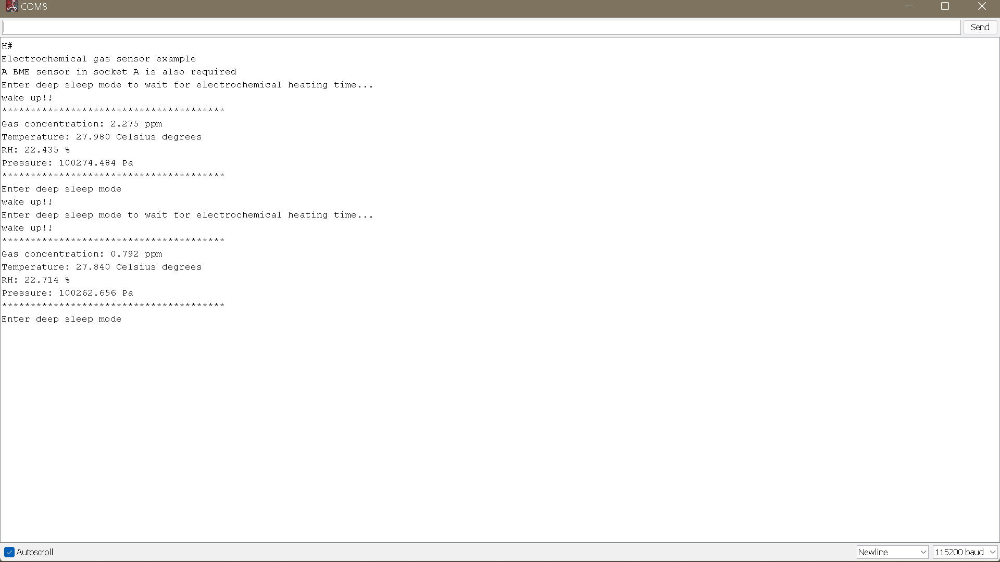
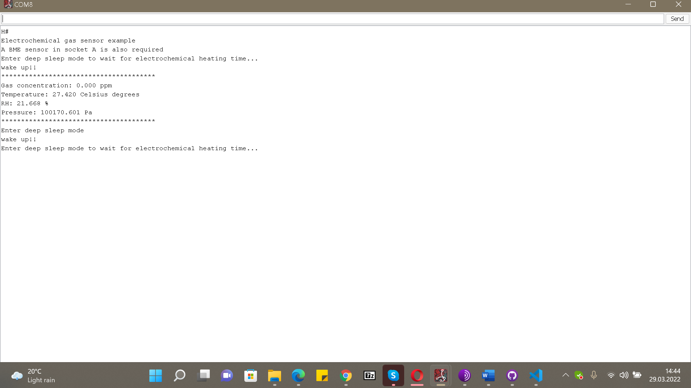

## Tested the TeleContact gas and temperature sensors

- Temperature sensor
- SO2 sensor
- NO2 sensor
- used the SCP1 Plug and Sense station

### Code used

```
/*
    ------------  [SCP_v30_01] - Electrochemical gas sensors  --------------

    Explanation: This is the basic code to manage and read an electrochemical
    gas sensor with Smart Cities PRO board. Electrochemical sensor list:
      - CO
      - O2
      - O3
      - NO
      - NO2
      - SO2
      - NH3
      - H2
      - H2S
      - HCl
      - HCN
      - PH3
      - ETO
      - Cl2

    Copyright (C) 2017 Libelium Comunicaciones Distribuidas S.L.
    http://www.libelium.com

    This program is free software: you can redistribute it and/or modify
    it under the terms of the GNU General Public License as published by
    the Free Software Foundation, either version 3 of the License, or
    (at your option) any later version.

    This program is distributed in the hope that it will be useful,
    but WITHOUT ANY WARRANTY; without even the implied warranty of
    MERCHANTABILITY or FITNESS FOR A PARTICULAR PURPOSE.  See the
    GNU General Public License for more details.

    You should have received a copy of the GNU General Public License
    along with this program.  If not, see <http://www.gnu.org/licenses/>.

    Version:           3.2
    Design:            David Gascón
    Implementation:    Alejandro Gállego
*/

#include <WaspSensorCities_PRO.h>


/*
   Define object for sensor: gas_sensor
   Input to choose board socket.
   Waspmote OEM. Possibilities for this sensor:
    - SOCKET_1
    - SOCKET_3
    - SOCKET_5
   P&S! Possibilities for this sensor:
    - SOCKET_B
    - SOCKET_C
    - SOCKET_F
*/
Gas gas_sensor(SOCKET_C);

/*
   Waspmote OEM. Possibilities for this sensor:
    - SOCKET_1
    - SOCKET_2
    - SOCKET_3
    - SOCKET_4
    - SOCKET_5
   P&S! Possibilities for this sensor:
    - SOCKET_A
    - SOCKET_B
    - SOCKET_C
    - SOCKET_E
    - SOCKET_F
*/
bmeCitiesSensor bme(SOCKET_E);


// variables
float concentration;  // Stores the concentration level in ppm
float temperature;  // Stores the temperature in ºC
float humidity;   // Stores the realitve humidity in %RH
float pressure;   // Stores the pressure in Pa


void setup()
{
  USB.println(F("Electrochemical gas sensor example"));
  USB.println(F("A BME sensor in socket A is also required"));
}


void loop()
{

  ///////////////////////////////////////////
  // 1. Read Temperature, humidity and pressure sensor (BME)
  ///////////////////////////////////////////
  
  // switch off gas sensor for better performance
  gas_sensor.OFF();
  // switch on BME sensor (temperature, humidity and pressure)
  bme.ON();
  
  // Read enviromental variables
  temperature = bme.getTemperature();
  humidity = bme.getHumidity();
  pressure = bme.getPressure();
 
  // switch off BME sensor (temperature, humidity and pressure)
  bme.OFF();
  // switch on gas sensor again
  gas_sensor.ON();


  ///////////////////////////////////////////
  // 2. Read gas sensor
  ///////////////////////////////////////////

  // Wait heating time
  // some sensors demand at least one minute 
  // of heating time after switching them on
  USB.println(F("Enter deep sleep mode to wait for electrochemical heating time..."));
  PWR.deepSleep("00:00:02:00", RTC_OFFSET, RTC_ALM1_MODE1, ALL_ON);
  USB.ON();
  USB.println(F("wake up!!"));
  
  // Read the electrochemical sensor and compensate with the temperature internally
  concentration = gas_sensor.getConc(temperature);

  // And print the values via USB
  USB.println(F("***************************************"));
  USB.print(F("Gas concentration: "));
  USB.printFloat(concentration, 3);
  USB.println(F(" ppm"));
  USB.print(F("Temperature: "));
  USB.printFloat(temperature, 3);
  USB.println(F(" Celsius degrees"));
  USB.print(F("RH: "));
  USB.printFloat(humidity, 3);
  USB.println(F(" %"));
  USB.print(F("Pressure: "));
  USB.printFloat(pressure, 3);
  USB.println(F(" Pa"));
  USB.println(F("***************************************"));


  ///////////////////////////////////////////
  // 3. Sleep
  ///////////////////////////////////////////

  // Go to deepsleep
  // After 2 minutes, Waspmote wakes up thanks to the RTC Alarm
  USB.println(F("Enter deep sleep mode"));
  PWR.deepSleep("00:00:02:00", RTC_OFFSET, RTC_ALM1_MODE1, ALL_ON);
  USB.ON();
  USB.println(F("wake up!!"));

}

```
### Output
SO2 sensor readings
<p align = "center"></p>

NO2 sensor readings
<p align = "center"></p>