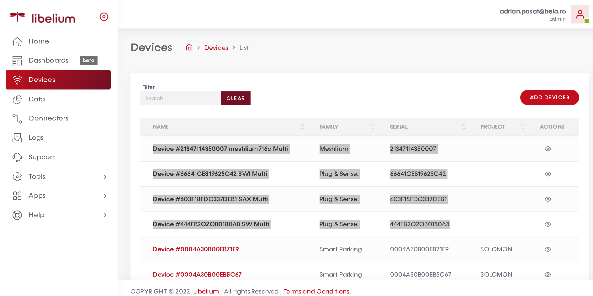
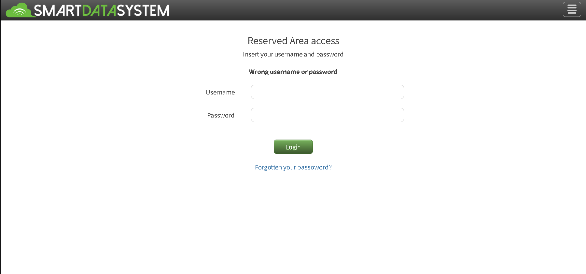

# Libelium_Cloud
<b>
MultiScale P&S stations
Model: Waspmote Plug&Sense! 4G EU/BR - Smart Water Ions - ID: 66641CEB19623C42
Model: Waspmote Plug&Sense! 4G EU/BR - Smart Water - ID: 444FB2C2CB0180A8 
Model: Waspmote Plug&Sense! 4G EU/BR - Smart Agriculture Xtreme - ID: 603F18FDC337DEB1
Model: Meshlium Scanner 4G AP EU - ID: 21347114350007 - WiFi AP ESSID: meshlium716c  
</b>

<h3>1. Libelium Cloud</h3>
The Libelium devices are registered in the Libelium Cloud platform.
Link here https://cloud.libelium.com/app/home

 

<h3>2. SmartData System platform</h3>
The Smart Agro Xtreme station is already registered in the platform, should be configured to send data in to SmartData platform. 
Link here https://app.smartdatasystem.es/?target=auth 

 

